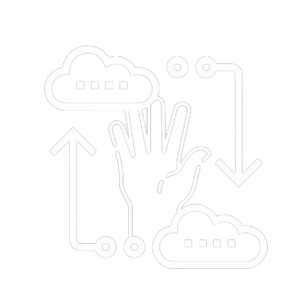
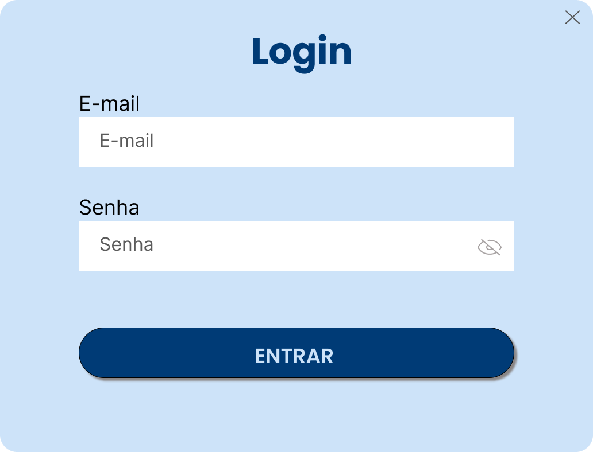
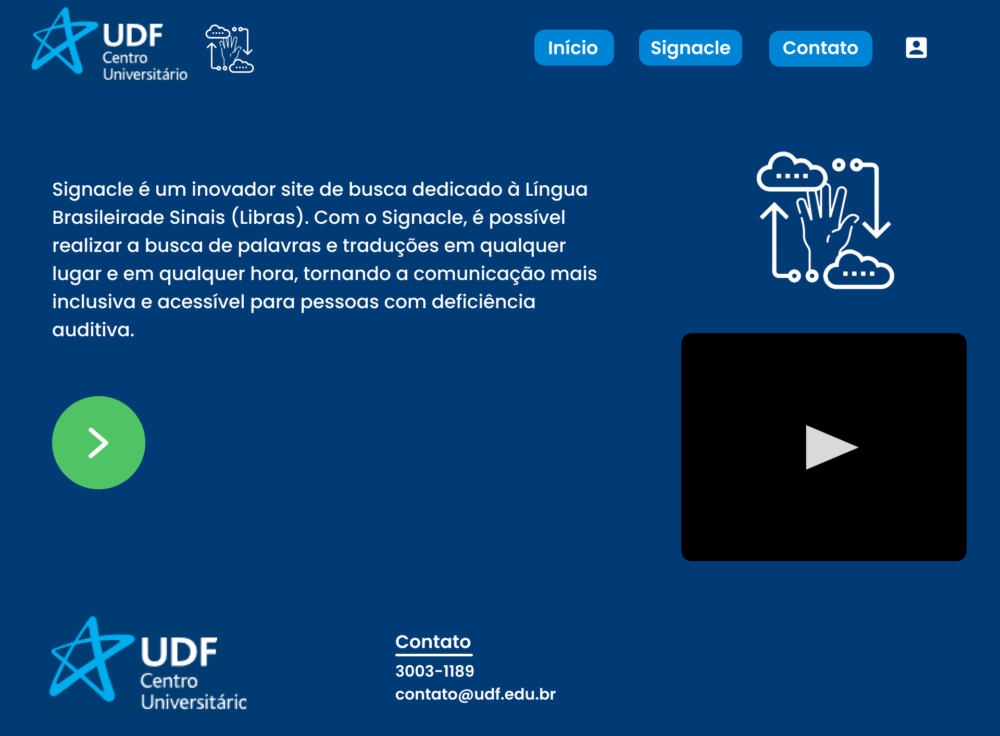
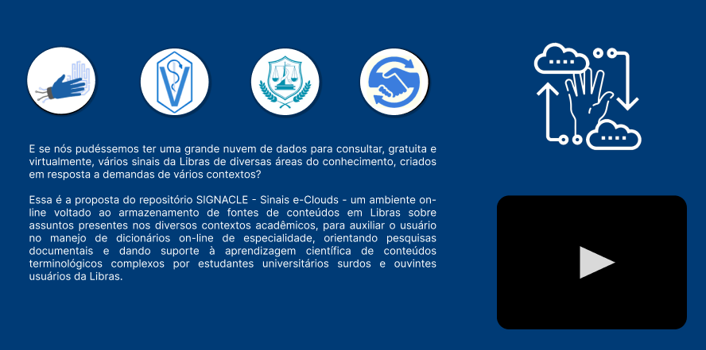
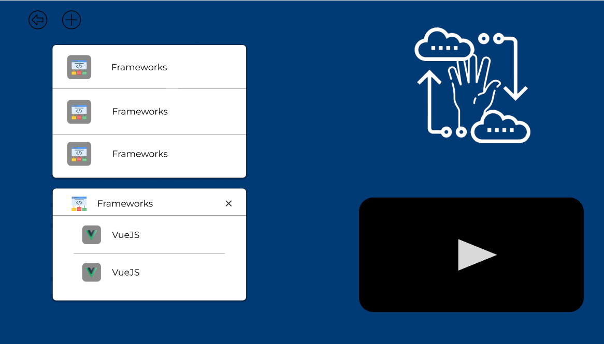
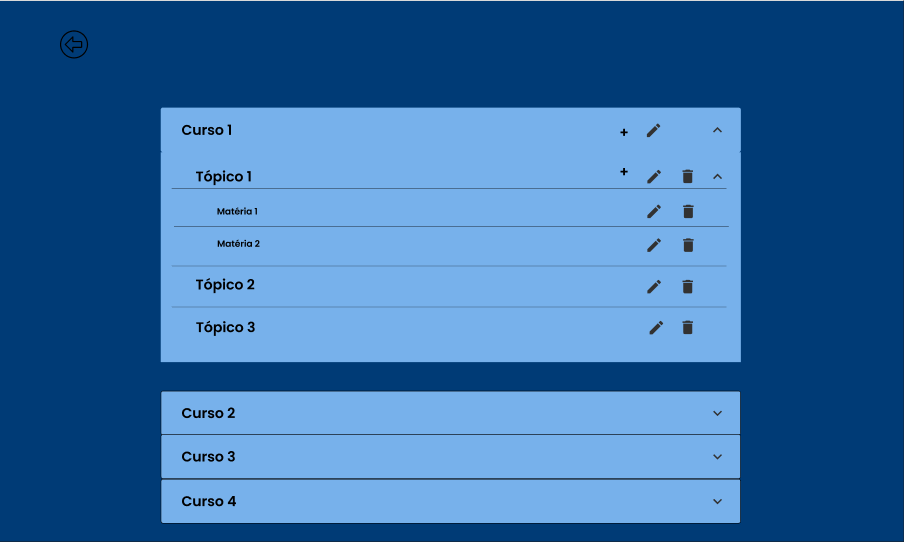
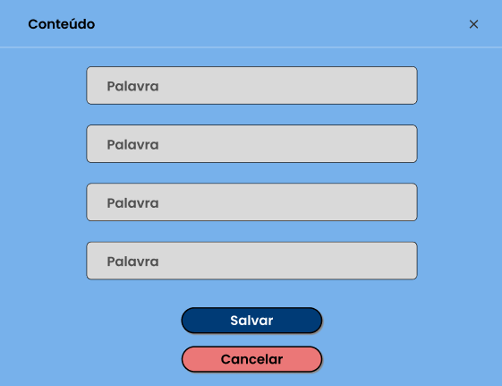

# Signacle - Site de Libras

**Signacle** é um projeto acadêmico desenvolvido para promover o aprendizado da Língua Brasileira de Sinais (Libras). Este site busca facilitar a interação dos usuários com conteúdos educacionais em Libras, promovendo a inclusão e o acesso à educação.

## Funcionalidades

### Barra de Navegação
A barra de navegação está presente em todas as páginas do site e possui os seguintes elementos:
- 

- **Logos**:
  - Logo da instituição de ensino UDF no lado esquerdo.
  - Logo do projeto Signacle.

- **Menu de Navegação**:
  - **Início**: Redireciona para a tela inicial.
  - **Signacle**: Direciona para a página principal do projeto.
  - **Contato**: Redireciona para o site da UDF.

- **Ícone-Botão Dinâmico**:
  - Se o usuário não estiver logado, exibe um ícone de login.
  - Ao clicar no ícone, é exibido um modal de login, onde o usuário pode acessar sua conta inserindo e-mail e senha.
  - **Login Modal**: O modal contém campos para e-mail e senha (o login só é permitido para usuários convidados que já possuem credenciais cadastradas).
   

### Footer (Rodapé)
O rodapé está presente em todas as páginas e inclui:

- **Logo da Instituição**: Exibida no lado esquerdo.
- **Coluna de Contato**: Contém informações de e-mail e telefone para suporte.
 

## Telas
### Tela Inicial
A tela inicial possui duas colunas principais:

1. **Coluna 1**:
   - Um texto explicando o propósito do **Signacle**.
   - Um botão abaixo do texto que leva o usuário para o repositório do Signacle.

2. **Coluna 2**:
   - Exibe a logo do projeto.
   - Apresenta um vídeo em Libras, que condiz com o texto explicativo da Coluna 1.

---

### Tela Signacle
A tela **Signacle** também está dividida em duas colunas:

1. **Coluna 1**:
   - Contém uma linha com opções de cursos disponíveis:
     - **TI**
     - **Medicina Veterinária**
     - **Nutrição**
     - **Business**
   - Ao clicar em um curso, o usuário é redirecionado para o repositório/catalogação dos sinais específicos do curso escolhido.
   - Abaixo da linha, há um texto explicando a proposta do Signacle.

2. **Coluna 2**:
   - Exibe a logo do projeto.
   - Apresenta um vídeo em Libras, no mesmo formato da Tela Inicial.

### Tela de sinais
Após clicado em um dos cursos, o usuário é redirecionado para
a tela do repositório do curso. Essa tela possui duas colunas:

1. **Coluna 1**:
   - Possui dois botões no topo da tela, que são os botões de voltar para a tela anterior, e o botão que direciona para a página de gerenciamento das Libras. Esse botão só aparece se o usuário estiver logado. 
   - Possui um **_Card_** que contém todas as matérias daquele curso. Quando clicado, um segundo cardo é aberto conforme a lista de baixo 👇
   - O segundo **_Card_** é aberto após o usuário clicar em uma matéria. Esse segundo **_Card_** contém todos os sinais de uma determinada tarefa, e quando um desses sinais é clicado, o vídeo da coluna da direita troca para o vídeo de como fazer esse sinal.

2. **Coluna 2**:
   - Exibe a logo do projeto.
   - Apresenta um vídeo em Libras do conteúdo de uma matéria que foi clicado.

### Tela de gerenciamento
Quando clicado no segundo botão da tela anterior, o usuário é direcionado para a tela de gerenciamento de sinais. Essa tela contém os seguintes conteúdos

   - Possui um botão para retornar a tela anterior
   - Possui um **_Accordion_** que o usuário pode abrir e fechar. Esse **_Accordion_** possui todos os cursos disponíveis, os tópicos/matérias de cada curso, e o conteúdo de cada tópico/matéria.
   Os itens possuem botões de adicionar, editar e excluir:
        - Adicionar: Sinal de '**+**', que quando clicado, pode ser adicionado um novo tópico para um curso, ou um novo conteúdo para um tópico/matéria.
        - Editar: Sinal de '**Lápis**', que quando clicado, pode se editar um tópico/matéria, ou os conteúdos de um tópico/matéria.
        - Excluir: Sinal de '**Lixeira**', que quando clicado, pode ser deletado os conteúdos de um tópico/matéria, ou até mesmo um tópico/matéria, removendo também todos os seus conteúdos.

        

- Quando algum item for clicado para adicionar/editar, um novo modal é aberto. Esse modal vai conter campos como:
    - **Palavra**: Palavra referente ao sinal.
    - **Descrição**: Descrição do sinal.
    - **Imagem**: Imagem referente ao sinal.
    - **Vídeo**: Vídeo para demonstrar como fazer esse sinal.
    - **Salvar**: Botão que vai salvar um novo conteúdo ou editar um conteúdo já existente.
    - **Cancelar**: Botão que irá cancelar a adição/edição de um sinal ou tópico.

